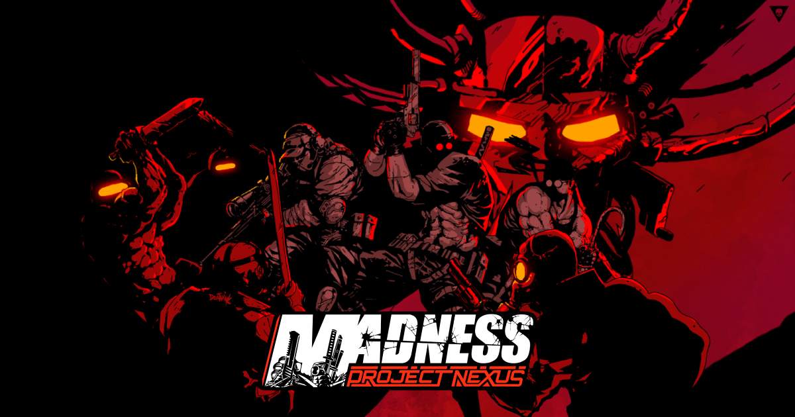

# Madness: Project Nexus - Landing Page



This is a front-end project developed using React, CSS, and GSAP. This landing page was created to practice my skills and showcase one of my favorite games. Access the [live demo](https://diego-laymi.github.io/madness-project-nexus/).

### Built With

- React
- Styled-Components
- GSAP

## Getting Started

To get a local copy, follow these simple steps.

### Prerequisites

If you're not a developer or have little experience, you will need to install some software on your computer:

- Node.js
- Npm
- Git

### Installation

1. Clone the project repository to your machine:

```
git clone https://github.com/diego-laymi/madness-project-nexus.git
```

2. Access the project directory:

```
cd madness-project-nexus
```

3. Install the project dependencies:

```
npm install
```

4. Edit the `vite.config.js` file by commenting out the `base` line:

```js
export default defineConfig({
  plugins: [react()],
  // base: "/madness-project-nexus",
});
```

5. Run the development server:

```
npm run dev
```

Now the project will be running at `http://localhost:5137`.

### Usage

After starting the development server, access `http://localhost:5137` in your browser.

## Contributing

If you have a suggestion that would make this better, please fork the repo and create a pull request. You can also simply open an issue with the tag "enhancement".

- Fork the Project
- Create your Feature Branch (git checkout -b feature/amazing-feature)
- Commit your Changes (git commit -m 'feat: add some amazing-feature')
- Push to the Branch (git push origin feature/amazing-feature)
- Open a Pull Request

## Disclaimer

This is an unofficial fan-made project based on MADNESS: Project Nexus. All rights to the game, characters, and original assets belong to their respective creators.

This project is not affiliated with or endorsed by the original developers.

Some images and visual assets used in this project may belong to their respective owners. If you are the owner of any content used here and would like it to be removed or credited properly, please contact me and I will take action as soon as possible.

## Credits

- Hero Page and Banner by [deathink](https://deathink.newgrounds.com/) – [Art](https://www.newgrounds.com/art/view/deathink/madness-project-nexus-2)

## License

This project is licensed under the [MIT](LICENSE.md) License
